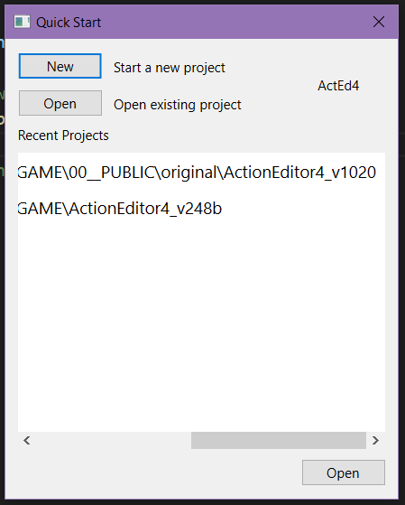
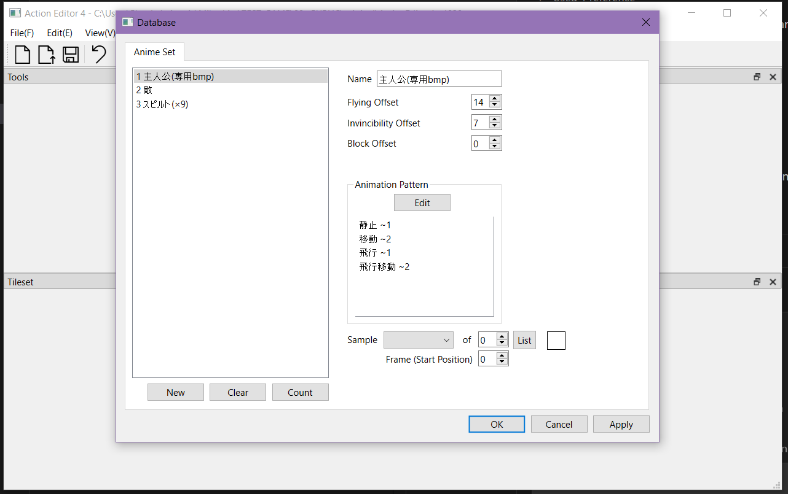
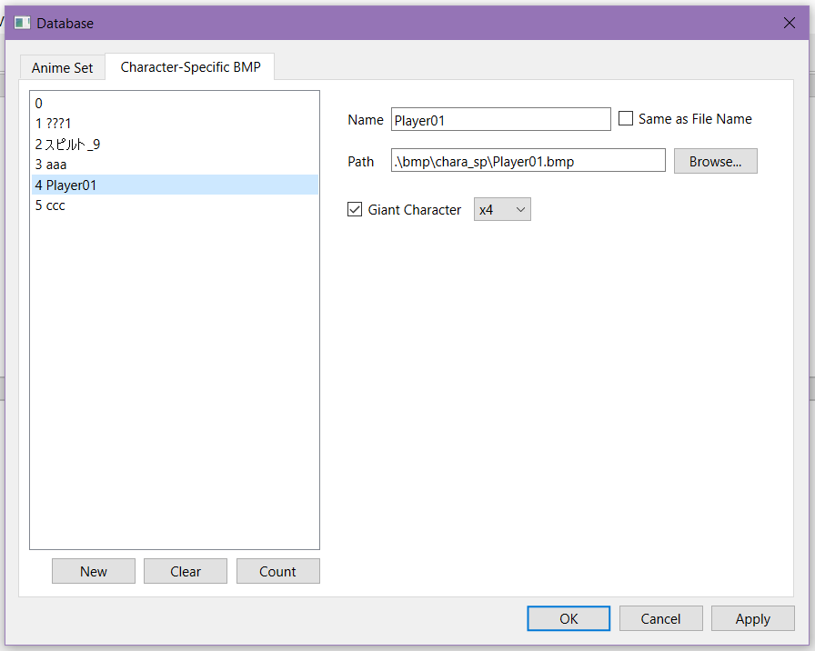

# Tools for working with ActionEditor4

ActionEditor4 is a now dead game engine wrote in 2008 by Anton. The site was located at `http://omoshiro-game.com/soft/ActionEditor4/` and is now for sale.

Patterns available on the "patterns" folder are meant to explore the binary files format used by the engine and can be used with "ImHEX" as "pattern", or adapted to any software to read original format

## Editor

An experimental re-implementation of the editor is ongoing under the "editor" folder:

The idea is to test quickly the various format parsing and compare them against the original engine to understand it better
